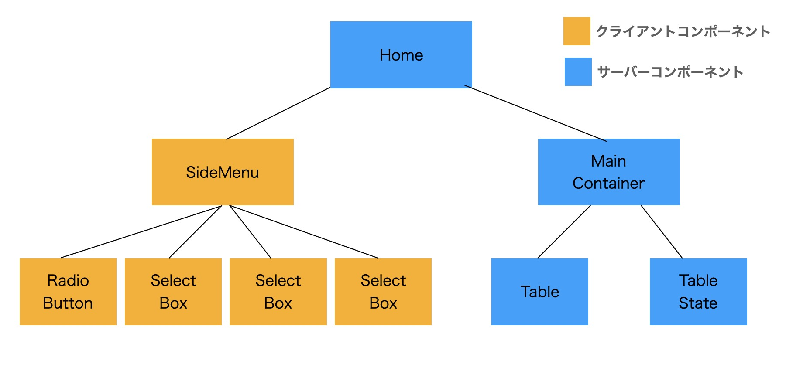

## <u>技術課題</u>

- URL: https://tech-task-flat.vercel.app/
- GitHub: https://github.com/daryuun5139/tech-task-flat

##### <仕様>

- セレクトボックス、ラジオボタンで選択した値がRecoilに格納される。（CC側）
- SideMenuコンポーネントにて、Recoilに格納された値をURLにクエリパラメータとして付加する。（CC側)
- Homeコンポーネントにて、クエリパラメータをsearchParams経由で取得する。（SC側)
- クエリパラメータをpropsとしてMainContainerコンポーネントに渡す。（SC側)
- 受け取ったクエリパラメータをもとにAPIからデータを取得し、データを表示する。（SC側)
※SC：サーバーコンポーネント、CC：クライアントコンポーネント

##### <所要時間>

- 初期設定 : 1h
- 初期レイアウト設定（CSSのみ） : 2h
- とりあえず動いて表示される状態（fetch API data & display data）：10h
- CSSの細部修正 : 2h
- レスポンシブ対応 : 2h
- その他リファクタリング

##### <懸念事項（残っているタスク）>

- データ更新中、表データ部分にローディングが表示されない。  
(Promiseのpending状態をSuspenseに読み取ってほしい)
- axiosでのエラーハンドリングの不足。  
  (エラー処理に穴があるだろうし、axiosの書き方も勉強不足)
- 初期表示で求人・求職者のデータが表示されているといっていいのか。  
  (一応SSG （Static Site Generation）になっていると思う)
- セレクトボックスで用いる都道府県一覧データをクライアント側で取得していいのか。
- なぜuseEffect内だとasync/awaitが使えるのか。
- データ更新でMainContainerコンポーネントが再レンダリングされると、他のコンポーネントも再レンダリングされる。
- CCからSCへのURL経由でのパラメータ渡しは一般的か。
